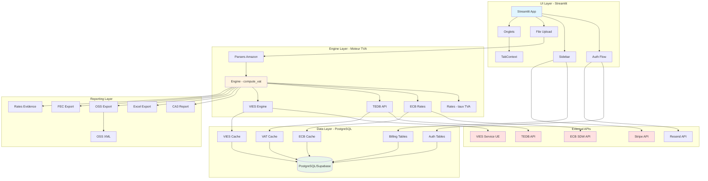

# Architecture du système TVA intracommunautaire

## Vue d'ensemble

Le système est organisé en couches : UI (Streamlit), Engine (moteur TVA), Data (base de données), et External APIs (services externes). Le flux principal est : Upload → Parsing → Calcul → Reporting.

## Diagramme d'architecture



## Flux principal

### 1. Upload et parsing
```
User → File Upload → Parsers (detect_format) → Parser (Format 1-5) → Sales
```

### 2. Calcul TVA
```
Sales → Engine (compute_vat) → VIES (validation) → ECB (conversion) → TEDB (taux) → VatResults
```

### 3. Reporting
```
VatResults → CA3 Report → HTML CA3
VatResults → Excel Export → Excel file
VatResults → OSS Export → Excel + CSV + XML
VatResults → FEC Export → FEC file
```

## Flux secondaires

### Authentification
```
User → Auth Flow → Magic Link → Email (Resend) → Verify → Session → Database
```

### Facturation
```
User → Sidebar → Billing → Stripe Checkout → Webhook → Database → Quotas
```

### Validation VIES
```
Engine → VIES Engine → Cache (privé/global) → VIES API → Override → Audit Log
```

### Taux de change
```
Engine → ECB Rates → Cache (mémoire + DB) → ECB API → Prefetch parallèle
```

### Taux TVA dynamiques
```
Engine → VAT Rates DB → Cache → TEDB API → Repli statique → Garde-fou
```

## Couches de l'application

### UI Layer (Streamlit)
- **Responsabilités** : Interface utilisateur, upload de fichiers, affichage des résultats
- **Modules** : `app.py`, `ui/sidebar.py`, `ui/tabs/`, `ui/auth_flow.py`
- **Dépendances** : Streamlit, Engine, Auth, Billing

### Engine Layer (Moteur TVA)
- **Responsabilités** : Classification fiscale, calcul TVA, validation VIES
- **Modules** : `engine.py`, `parsers/`, `rates.py`, `vies_engine.py`, `ecb_rates.py`, `vat_rates_db.py`
- **Dépendances** : Models, External APIs, Database

### Reporting Layer
- **Responsabilités** : Génération des exports (CA3, Excel, OSS, FEC)
- **Modules** : `ca3_report.py`, `excel_report.py`, `oss_export.py`, `oss_xml.py`, `fec_export.py`
- **Dépendances** : Engine, External APIs

### Data Layer (PostgreSQL)
- **Responsabilités** : Persistance des données, cache, audit
- **Modules** : `database.py`, `auth.py`, `billing.py`, `vies_engine.py`, `ecb_rates.py`, `vat_rates_db.py`
- **Dépendances** : PostgreSQL/Supabase

### External APIs
- **Responsabilités** : Services externes pour validation, taux, facturation
- **Services** : VIES (UE), BCE (taux change), TEDB (taux TVA), Stripe (facturation), Resend (email)
- **Dépendances** : Aucune (services externes)

## Base de données partagée

La base de données PostgreSQL/Supabase est partagée entre plusieurs modules :

### Tables principales
- `magic_links` : Tokens de vérification pour magic link
- `sessions` : Sessions utilisateur
- `tva_subscriptions` : Abonnements Stripe
- `tva_export_credits` : Crédits d'export PAYG
- `tva_sirens` : SIREN enregistrés par organisation
- `vies_global_cache` : Cache VIES global
- `vies_scope_cache` : Cache VIES privé par scope
- `vies_overrides` : Overrides manuels VIES
- `vies_audit_log` : Historique d'audit VIES
- `ecb_rate_cache` : Cache des taux de change BCE
- `vat_rate_cache` : Cache des taux de TVA TEDB

### Pool de connexions
- Utilisation de `NonPoolingConnectionPool` (database.py)
- Compatible scale-to-zero (cache par thread)
- Gestion centralisée des connexions

## Services externes

### VIES (VAT Information Exchange System)
- **Rôle** : Validation des numéros TVA intracommunautaires
- **Endpoint** : Service SOAP de la Commission européenne
- **Cache** : Double niveau (privé/global) avec TTL 24h
- **Retry** : Exponentiel avec backoff

### BCE (Banque Centrale Européenne)
- **Rôle** : Taux de change EUR
- **Endpoint** : SDW (Statistical Data Warehouse)
- **Cache** : Double niveau (mémoire + PostgreSQL) avec TTL 24h
- **Retry** : Exponentiel avec backoff

### TEDB (Taxes in Europe Database)
- **Rôle** : Taux de TVA dynamiques
- **Endpoint** : API de la Commission européenne
- **Cache** : PostgreSQL avec TTL 24h
- **Repli** : Tables statiques (`rates.py`)
- **Garde-fou** : Plausibilité (écart > 3 points vs statique)

### Stripe
- **Rôle** : Facturation (PAYG, Pro, Cabinet)
- **Endpoint** : API Stripe
- **Webhook** : Vercel function (`vercel_webhook/api/stripe_webhook.py`)
- **Métadonnées** : org_id, user_id, period_label, siren

### Resend
- **Rôle** : Envoi d'emails (magic link)
- **Endpoint** : API Resend
- **Contenu** : Magic link avec token

## Patterns architecturaux

### Pool de connexions partagé
- Un pool partagé par thread pour PostgreSQL
- Compatible scale-to-zero (pas de connexions persistantes)
- Géré par `database.py`

### Cache multi-niveaux
- VIES : privé (scope) + global
- ECB : mémoire + PostgreSQL
- TEDB : PostgreSQL + repli statique
- TTL configurable par service

### Retry exponentiel
- Utilisé pour toutes les APIs externes
- Configurable (max_attempts, backoff_base)
- Cache négatif des échecs

### Gating billing
- Vérification des quotas avant calcul
- Gating des téléchargements
- Intégration Stripe pour l'abonnement

### Contexte partagé UI
- `TabContext` stocké dans `st.session_state`
- Partagé entre tous les onglets
- Évite les fuites mémoire de Streamlit

## Sécurité

### Chiffrement PII
- Données sensibles chiffrées avec Fernet
- Géré par `security.py`
- Clé Fernet configurée via `FERNET_KEY`

### Authentification
- Magic link + session token
- OAuth via Supabase Auth (Google, Microsoft, GitHub, Amazon)
- PKCE pour OAuth

### isolation des scopes
- VIES cache isolé par scope
- Overrides manuels par scope
- Audit trail complet

## Performance

### Optimisations
- Prefetch parallèle des taux (ECB, TEDB)
- Cache multi-niveaux
- Batching VIES (futur)
- Interning des notes (cache LRU)

### Mémoire
- Openpyxl en mode write-only pour Excel
- Gestion du cache LRU pour les notes
- Nettoyage des connexions inactives

## Scalabilité

### Scale-to-zero
- Compatible avec les environnements serverless
- Pool de connexions non persistant
- Cache en mémoire réinitialisé par instance

### Multi-tenant
- Isolation par scope (org_id)
- Quotas par organisation
- Cache partagé pour les données publiques (BCE)

## Déploiement

### Environnements
- **Dev** : Local avec variables d'environnement
- **Staging** : Streamlit Cloud
- **Prod** : Streamlit Cloud + Vercel (webhook Stripe)

### CI/CD
- Pipeline GitHub Actions pour les tests
- Tests unitaires et d'intégration
- Déploiement automatique sur main
